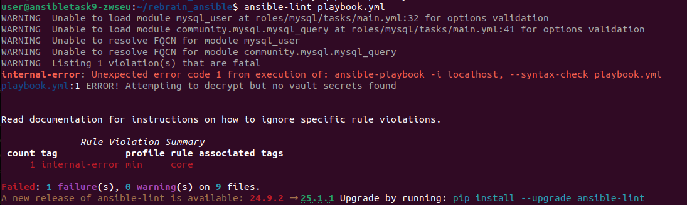
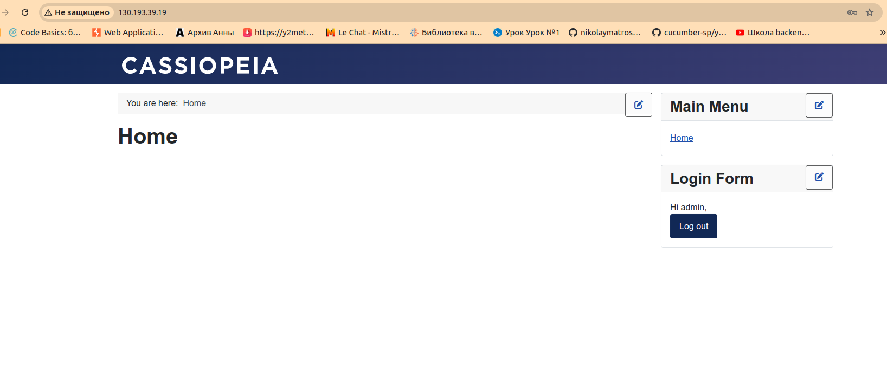

Добавляем в inventory.yaml данные целевого хоста и запускаем плейбук:
```
ansible-playbook -i inventory.yaml playbook.yml --ask-vault-pass
```
После завершения работы плейбука переходим в браузере по ip-адресу целевого 
хоста, вводим название компании, логин-пароль администратора, имя пользователя 
и пароль к базе данных.

Проверка ansible-lint:



Проверка создания сайта:


